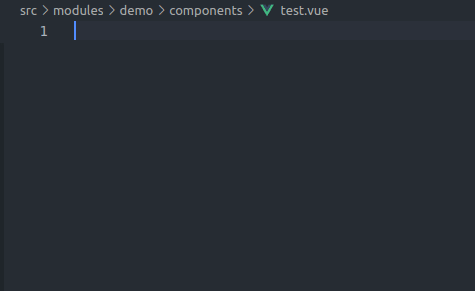
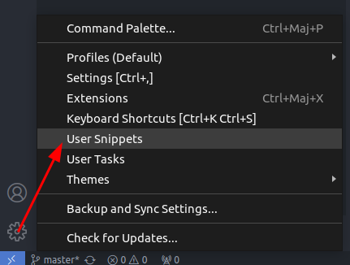
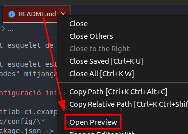

# Introducció

## Objectiu tema

Familiarització amb l'Entorn de Desenvolupament: Ser capaç de configurar l'entorn de desenvolupament Visual Studio Code, incloent la instal·lació i ús de plugins i snippets rellevants per agilitzar el seu flux de treball.

## Configuració de l'entorn

Per a poder realitzar el curs serà necessari tenir instal·lat una serie de components.

- **Node**: Entorn en temps d'execució JavaScript. Versió 16 o superior. [enllaç](https://nodejs.org/en)
- **Yarn**: Gestor de paquets yarn [enllaç](https://classic.yarnpkg.com/en/)
- **VSCode**: (recomanat) Editor de codi [enllaç](https://code.visualstudio.com). Es recomana l'ús d'aquest editor encara que cada un es lliure de fer-ho amb el que més li agradi.
- **Docker**: (opcional) Gestor de contenidors [enllaç](https://www.docker.com). Encara que queda fora del curs es faciliten els DockerFiles per executar-ho amb aquest entorn.

## VSCode

Visual Studio Code aka vscode es un edidor de codi multiplataforma creat per Microsoft.

Vscode és flexible i àgil, cosa que ens facilita l'edició de codi, a més, de permetre instalar plugins per adaptar-lo a les nostres necessitats.

Encara que no es obligatori usar aquest editor es la opció recomanada.

### Plugins

Els plugins o extensions son complements addicionals que amplien la funcionalitat de vscode per a adaptar-ho a les nostres necessitats.

A continuació es llistan una serie de complements a tenir en compte:

- [Vue Volar extension Pack](https://marketplace.visualstudio.com/items?itemName=MisterJ.vue-volar-extention-pack)
  - [Vue Volar](https://marketplace.visualstudio.com/items?itemName=Vue.volar): Suport per a VUE
  - [Path Intellisense](https://marketplace.visualstudio.com/items?itemName=christian-kohler.path-intellisense): autocompleta nom de fitxers
  - [Auto Close Tag](https://marketplace.visualstudio.com/items?itemName=formulahendry.auto-close-tag): Tanca automàticament les etiquetes
  - [Auto Rename Tag](https://marketplace.visualstudio.com/items?itemName=formulahendry.auto-rename-tag): Renombra la parella d'etiquetes al editar una.
  - [ESLint](https://marketplace.visualstudio.com/items?itemName=dbaeumer.vscode-eslint): Analitzador de codi
  - [Sass](https://marketplace.visualstudio.com/items?itemName=Syler.sass-indented): Formatejador de codi SASS
  - [SCSS Formatter](https://marketplace.visualstudio.com/items?itemName=sibiraj-s.vscode-scss-formatter): formatejador de SCSS
  - [Prettier](https://marketplace.visualstudio.com/items?itemName=esbenp.prettier-vscode): Formatejador de codi
- [Vue 3 Support - All In One](https://marketplace.visualstudio.com/items?itemName=Wscats.vue): Complements per a VUE3
- [Vue VSCode Snippets](https://marketplace.visualstudio.com/items?itemName=sdras.vue-vscode-snippets): Snippets per a VUE3
- [CodeMetrics](https://marketplace.visualstudio.com/items?itemName=kisstkondoros.vscode-codemetrics) (opcional): Calcula la complexitat del codi indicant quant conve millorar-ho.
- [Material Icon Theme](https://marketplace.visualstudio.com/items?itemName=PKief.material-icon-theme) (opcional): Canvi d'icones, especialment útil per a la identificació dels fitxers.

### Settings

La configuració del workspace permet establir una configuració per a un projecte en concret.

Per a poder establir la configuració s'ha d'editar (o crear) el fitxer `<arrel projecte></arrel>/.vscode/settings.json`. 

A continuació la configuració recomanada que poder personalitzar al vostre gust:
```json
{
  "eslint.alwaysShowStatus": true,
  "eslint.format.enable": true,
  "editor.bracketPairColorization.enabled": true,
  "editor.guides.bracketPairs": true,
  "editor.formatOnSave": true,
  "editor.defaultFormatter": "esbenp.prettier-vscode",
  "editor.codeActionsOnSave": {
    "source.fixAll.eslint": true,
    "source.organizeImports": true
  },
  "eslint.validate": ["javascript", "javascriptreact", "typescript", "vue"],
  "typescript.tsdk": "node_modules/typescript/lib",
  "editor.tabSize": 2,
  "i18n-ally.localesPaths": ["src/locales", "src/core/i18n"]
}
```

### Snippets

Els snippets son plantilles de fragments de codi que vscode ens permet cridar per a insertar aquest codi al fitxer que estam editant.

Una de les extensions que hem instal·lat ja incorpora una serie de snippets útils com per exemple: `vbase-3-ts-setup` o abreujat `vb3tss`.

Com podeu veure basta començar a escriure per a que es mostrin les opcions i acceptar en sortir la que dessitjam



A més dels snippets que ens proporcionen les extensions tambè podem crear els nostres.



Una vegada seleccionada aquesta opció haurem de marcar el llenguatge en concret i ens apareixerà l'editor. Aqui podem anar afegint un element per a cada snippet que volgem:

```json
  "composable": {
		"prefix": "composable",
		"body": [
			"export const use$1 = () => {"
			"	return {}"
			"}"
		]
	}
```
El `prefix` es el nom per el que cercarem i el `body` el contingut que es pintarà. Notar que es poden posar variables amb $1, $2... Una vegada s'inserti el codi el cursor es posarà al lloc de les variables per a poder completar.

[Més informació](https://code.visualstudio.com/docs/editor/userdefinedsnippets)

## Esquelet

Descarregarem l'esquelet de Vue 3 desde l'enllaç adjunt al curs en format ZIP i el descomprimirem.

Una vegada dins hem de llegir i seguir les instruccions del README.md

*Amb vscode podem previsualitzar el fitxer fent clic amb el boto secundari damunt el fitxer:*



Encara que les opcions del `.env` no seràn usades si que s'ha de crear el fitxer.

### Docker

L'estudi de docker surt de l'abast d'aquest projecte. Així i tot s'adjunten un model de configuració.

```yml
# docker-compose
version: "3.7"
services:
  frontend:
    build:
      context: ./
      dockerfile: Dockerfile
      args:
        # proxy: "http://proxycentral.imasmallorca.net:8080/"
    container_name: cursVue-frontend
    image: cursVue-frontend
    ports:
      - "8080:8080"
    volumes:
      - ./frontend/:/app
```

```docker
# Dockerfile
# Name the node stage "builder"
FROM node:16 AS builder

ARG proxy

ENV http_proxy $proxy
ENV https_proxy $proxy

# Set working directory
WORKDIR /app

# Copy all files from current directory to working dir in image
COPY . .

CMD ["yarn", "dev-docker"]
```