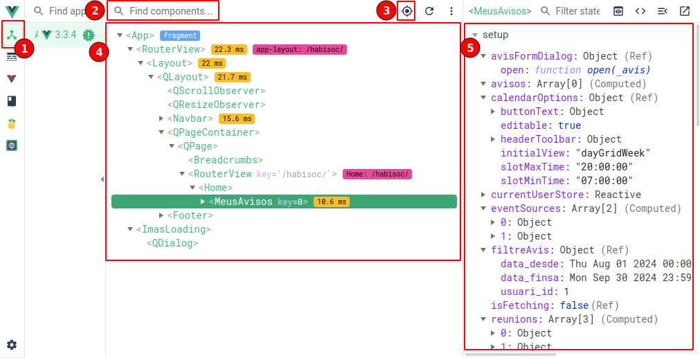

# Components

## Objectiu tema

Desenvolupament de Components Reactius: Entendre i aplicar conceptes de reactivitat en el desenvolupament d'aplicacions, creant components reactius i eficients.

## Basics

Els components són elements, normalment visuals, que ens permeten separar i reutilitzar part del codi. El framework Quasar ens aporta un conjunt de components que podem usar, apart de definir els propis de l'aplicació.

- Els components s'han de definir dins una carpeta components dins cada mòdul. En cas de ser genèric dins la carpeta components del mòdul shared.
- Les rutes no han d'apuntar directament a un component.
- El nom del component ha de ser descriptiu i ha de contenir més d'una paraula. Ex: ExpedientFormDialog, ExpedientCard, ExpedientList...

Els components, per definició, seran instanciats desde una vista o un altre component formant un arbre de relacións on l'arrel serà el layout. D'aquest layout partiran les vistes i finalment els components que poden formar distinta profunditat dins l'arbre. Posem un exemple:

- Layout
  - ExpedientList (view)
    - ExpedientFiltre (component)
      - Form (component)
      - Input (component)
      - Button (component)
    - ExedientFormDialog (component)
      - Form (component)
      - Input (component)
      - Input (component)
      - InputDate (component)
      - Button (component)
    - Button (component)
  - ExpedientView (view)
    - ExpedientFormDialog (component)
      - ...
    - ...

Com es pot veure un mateix component pot ser instanciat a distins llocs amb paràmetres diferents. Per exemple el component `ExpedientFormDialog` serà instanciat dins `ExpedientList` en mode creació i dins `ExpedientView` en mode edició.

També es pot instanciar un mateix component multiples vegades dins un mateix component o vista. Per exemple el component `Input` dins `ExpedientFormDialog` per a editar les propietats `num_expedient` i `num_segex`.

> Cas pràctic

La part del template del darrer exemple podria quedar una cosa així

```html

<template>
  <div>
    <Form>
      <Input v-model="expedient.num_expedient"/>
      <Input v-model="expedient.num_segex"/>
      <Button type="submit" :label="expedient.id ? 'Guardar' : 'Crear' "/>
    </Form>
  </div>
</template>

```
*NOTA: Dins la part de script s'han d'importar el components*

Aquesta jerarquia de components provoca que un component tengui el rol de `pare` i l'altre de `fill`.

## Tipus

Diferenciarem els components en:

### **Especifics**

Els components específics són propis de l'aplicació en qüestió, que estam desenvolupant, normalment quedaran lligats a models de dades del projecte.

A més de reutilitzar còdi, també ens serviran per a simplificar i aplicar solucions més avançades.

> Cas pràctic

Un exemple clar on usar aquest tipus de component és quan volem pintar un array d'elements on cada element agafa un disseny diferent. Per exemple, si volem pintar els expedients d'una persona i personalitzar el color i la icona de l'expedient en funció de l'estat, l'ideal seria fer un component fill que tengui tota aquesta lògica.

### **Genèrics**

Els components genèrics no estan lligats a un model de dades en concret sinó que reben paràmetres per a la seva configuració com podrien ser: títol, color...

La importància d'quests components és que ajuden a donar una homogeneïtat en el disseny, el que provoca que sigui més intuitiva per als usuaris.

A més, en cas de voler fer un canvi, basta editar un fitxer per a modificar-ho a tota l'aplicació.

> Cas pràctic

Anam a veure una captura d'una plantilla d'un dahsboard qualsevol


Podem observar l'ús recurrent de targetes de colors amb la informació més destacada de la pàgina en qüestió.

Es podria fer un component genèric que rebi com a paràmetres una icona, un color, un títol, un subtítol i un enllaç i reutilitzar aquest component a les capçaleres de les nostres vistes per a destacar la informació.

## Interacció entre components

Els components habitualment es comuniquen entre ells per compartir dades, més enllà d'usar una store per certs recursos globals.

Disposam de tres formes principals: Props, Emits i Exposes

### Props

Les propietats són valors de lectura que envia un component pare al fill.

Definició al component fill

```typescript
interface Props {
  expedient: Expedient;
  actiu?: boolean; //paràmetre opcional
}

const props = defineProps<Props>();

// opcionalment podriem definir valors per defecte
const props = withDefaults(defineProps<Props>(), {
  actiu: true,
});
```

Al component pare faríem la cridada al component fill

```html
<ExpedientCard :expedient="expedient" actiu />
```

_Notar que si volem establir una propietat boleana a true basta definir el seu nom sense especificar valor_

Les props no són reactives per defecte, per tant, si canvien no s'actualitzen. Una solució podria ser usar toRef per convertir una propietat a ref

```typescript
const expedient = toRef(props, "expedient");
// o
const { expedient } = toRefs(props);
```

### Emits

Si volem retornar valors al component pare hem d'usar els emits, aquest executaran una funció que s'ha de definir al component pare.

Al component fill definim els emits. Aquest ha de tenir un nom i poden tenir variables

```typescript
interface Emits {
  (e: "update", data: Expedient): void;
}
const emit = defineEmits<Emits>();

// En el moment d'actualitzar les dades hem de cridar l'emit
emit("update", expedient.value);
```

Al component pare hem de definir un mètode que s'executarà quan el fill cridi l'emit. Aquest mètode rebrà com a paràmetres els indicats a la definició.

```html
<ExpedientCard @update="actualitzaExpedient" />
```

> **Curiositat:**
>
> Al cridar un emit no sabem si el component pare ha establert un mètode que s'executarà. En alguns casos, calcular el valor que s'ha d'emetre, pot ser costos i ens interessa saber si el pare ha definit un mètode o no, ja que, en cas negatiu, no fa falta executar la lògica.
>
> En aquests casos podem definir una Prop amb el mateix nom del mètode precedida de 'on':

```typescript
interface Props {
  onUpdate: Function | undefined
}
interface Emits {
  (e: 'update', data: Expedient): void
}

...

if(props.onUpdate){
  const res = calculCostos()
  emit('update',res)
}

```

### Expose

Finalment, tenim els expose que ens permeten executar un mètode dins un component fill des del component pare. Per exemple, pot ser d'utilitat per obrir un dialog definit dins un component.

Definim l'expose al component fill

```typescript
const open = (_expedient: Expedient) => {
  expedient.value = Expedient.from(_expedient);
  dialog.value = true;
};

defineExpose({ open });
```

Al component pare hem de definir un ref i cridar el mètode

```html
<ExpedientFormDialog ref="expedientFormDialog" />
```

```typescript
// instanciam la variable, ha de tenir el mateix nom que el ref del component
const expedientFormDialog = ref();

// El moment de voler cridar el mètode
expedientFormDialog.value.open(expedient.value);
```

## Slots

Els slots són una altra forma d'interacció entre uns components pare i fill. Els Slots ens permeten insetar codi dins un component fill que hem definit al component pare. Els slots són realment útils si volem definir component genèrics.

Per defecte, el contingut que definim dins les etiquetes del component fill es correspon a slot.

```html
<!-- Component pare intancia un component fill -->
<CustomCard>
 // Contingut de slot
</CutomCard>
```

Dins el component fill s'ha de definir la posició d'aquest component.

```html
<div class="card">
  <div class="card__title">...</div>
  <div class="card__content">
    <slot></slot> // Posició on s'insertarà el codi
  </div>
</div>
```

### Scope

Per defecte, els slots tenen accés a les variables del component pare, però no a les del fill. És a dir, si el component d'exemple CustomCard, rep un paràmetre estat amb el que calcula el color, dins el nostre slot no hi tendrem accés.

Això es pot solucionar passant paràmetres al slot.

```html
<slot :color="colorCalculat"></slot>
```

Ara al component pare tenim accés a la propietat color definit `v-slot`

```html
<CustomCard v-slot="slotProps">
  {{ slotProps.color }}
</CutomCard>
```

### FallBack

Definir un scope no és obligatori i es pot donar el cas que un component pare no defineixi un scope. En aquest cas podem definir un codi de fallback que es pintarà en els casos en què no s'ha definit.

Senzillament s'ha de definir el codi dins l'slot.

```html
<slot> // Codi de fallback </slot>
```

### Named

Tenim la posibilitat de posar un nom als slots, cosa que ens permetrà poder tenir múltiples slots din uns component. Per a fer-ho hem de definir un `name` a cada `v-slot`

```html
<div class="card">
  <div class="card__title">
    <slot name="title"></slot>
  </div>
  <div class="card__content">
    <!-- Podem continuar tenint un slot per defecte -->
    <slot></slot>
  </div>
  <div class="card__actions">
    <slot name="actions"></slot>
  </div>
</div>
```

Al component pare hem de diferenciar cada slot amb un template.

```html
<CustomCard>
 // Contingut de slot default

  <template v-slot:title>
    // Contingut slot titol
  </template>
</CutomCard>
```

> Nota: es pot definir un slot de forma abreujada

```html
<template v-slot:title></template>
<!-- Equivalent a-->
<template #title></template>
```

#### Nom dinàmic

Existeix la possibilitat de definir slots de forma dinàmica. Per a definir un slot amb nom dinàmic hem de definir la variable entre `[]`

```html
<template v-slot:[nomSlot]></template>
<!-- Es pot combinar amb part fixa -->
<template v-slot:partFix-[nomSlot]></template>
```

> Cas pràctic

Els noms dinàmic són especialment útils per a definir slots d'arrays d'elements. Suposem el cas que volem pintar un llistat i disposam d'un array d'elements amb les propietats id, nom, valor. Podem definir el següent slot dinàmic.

```html
<!-- Cada element genererà un slot anomenat 'element-{id}'-->
<template
  v-for="element of elements"
  :key="element.id"
  v-slot:element-[element.id]
  :element="element"
>
  {{ element.label }}: {{ element.value }}
</template>
```

En declarar el component, podem reemplaçar alguns elements del nostre llistat per un slot personalitzat. Suposem un element estat que té un color en funció de l'estat:

```html
<CustomList>
  <template v-slot:element-estat="slotProps">
    <span :class="'bg-color-' + slotProps.element.value">
      {{ slotProps.element.value }}
    </span>
  </template>
</CustomList>
```

## DevTools: inspector de components

La primera eina que veurem es l'inspector de components. De forma similar a l'inspector d'elements html del developer tools del navegador, l'inspector de components ens permet veure els componentns en una estructura d'arbre. Una vegada cercam i accedim a un component podem veure les variables que hem declarat dins el setup i el seu valor actual.



1. Pipella de l'inspector de components.
2. Cercador de components
3. Cercador de components de forma grafica, ens permet seleccionar el component clicant el component visualment.
4. Navegació en forma d'arbre dels components.
5. Propietats del component seleccionat, ens permet veure en temps reals els valors i modificar-los.
