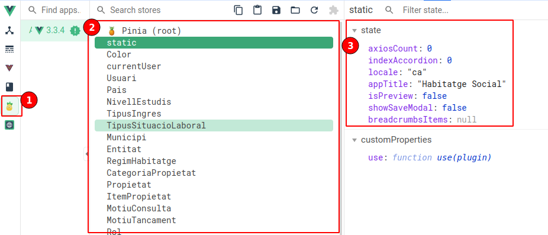

# Stores: Pinia

## Redux

El patró de disseny redux intenta solventar la problemàtica dels frameworks basats en components on s'ha de passar informació d'un component a un altre mitjançant propietats. Actualitzar aquesta informació dins un component implica definir tota una lògica de comunicació, entre components, per actualitzar la mateixa informació a la resta de components.

La nova aproximació es basa en la creació d'un o diversos **store** on guardar i centralitzar la informació i d'aquesta manera disposar únicament d'una copia de les dades i no una per component.


Dins VUE disposam de la llibreria Pinia per a implementar aquesta aproximació. Conjuntament amb la reactivitat de VUE es fa molt senzill mantenir la informació actualitzada a tota l'aplicació.

## Pinia

https://pinia.vuejs.org/

Pinia es la llibreria recomanada, per VUE, per a la implementació de les stores en aquest framework.

De forma semblant als composables, un store defineix una lògica i exposa unes propietats i mètodes(actions) per a poder interactuart amb el contingut.

La forma de definir un store es senzilla. Com a convenció el nom de la store es `useNomStore`

D'igual forma que VUE, les stores tenen dues formes de definir: `Options` i la forma `Setup`, a partir d'ara ens centrarem en aquesta darrera.

```typescript
export const useAppStore = defineStore('app', () => {
  const currentUser = ref<Usuari | null>(null)

  const setUser = (user) => {
    currentUser.value = user
  }

  return {
    // Propietats
    currentUser

    // Metodes
    setUser
  }
})
```

La forma de cridar aquesta store es senzillament cridant l'export que hem definit. Hem de tenir clar que sempre que cridem a una store obtindrem la mateixa instancia (aquesta es crea la primera vegada que s'usa) i actualitzar les dades desde un component actualitzarà la resta de components que facin us de la mateixa store (sempre que haguem implementat correctament la reactivitat)

```typescript
const appStore = useAppStore();

// Per a accedir a una propietat del store
appStore.currentUser;
```

### Reactivitat

Les propietat d'una store no son reactives per defecte quant es descomposen. Per descomposar una store en propietats reactives hem de fer un l'eina incorporada a pinia: `storeToRefs`

```typescript
// No s'actualitzarà!!
const { currentUser } = appStore;

// Aquesta es la forma correcte
const { currentUser } = storeToRefs(appStore);
```

D'aquesta manera tots els canvis d'un component a l'store quedaràn reflectits a la resta de components de forma automàtica.

## Store vs props/emits

Les stores son una eina pràctica, però no implica que sigui l'adequant per a tots els casos. En la pràctica, l'ús de les propietats i els emits hauria de ser major que l'us de les stores, que sol quedar reservat a dades d'us general de l'aplicació, com dades que venen del backend o dades que volem guardar entre la navegació per pàgines.

### Casos d'ús:

_Els seguents exemples es mostren per separat, però a la practica es poden integrar en una mateixa store._

#### Breadcrumbs: dades de navegació

La navegació es sol implementar de forma global, amb el layout, però la informació canvia a cada pàgina que visitam.

Per exemple dins una pàgina de llistat d'expedients tendriem

`Home > Expedients`

I al entrar dins un expedient, podriem tendríem

`Home > Expedients > 10/2024`

Però al accedir al llistat d'usuaris canviaria a:

`Home > Usuaris`

Mitjançant propietats i emits ens implicaria definir la lògica de traspas d'informació a cada pàgina fins al layout i d'aquest fins al component de breadcrumbs. La solució es una senzilla store:

```typescript
export type BreadCrumbsItem = {
  label?: string;
  to?: RouteLocationRaw | undefined;
  icon?: string | undefined;
};

export const useBreadCrumbsStore = defineStore("BreadCrumbs", () => {
  const breadcrumbsItems: BreadCrumbsItem[] | null;

  return {
    breadcrumbsItems,
  };
});
```

Amb aquesta store, podem modificar la informació de navegació desde qualsevol pàgina a traves de l'store.

```typescript
const breadCrumbsStore = useBreadCrumbsStore();

breadCrumbsStore.breadcrumbsItems = [
  { label: "Home" },
  { label: "Expedients" },
];
```

#### Guardar filtre durant la navegació

Una altre situació on usar una store podria ser el cas del filtre de llistats. Per exemple: volem modificar certs expedients aplicant un filtre. Una vegada hem filtrat els resultats accedim dins un expedient, el modificam i al sortir tornam a tenir el filtre buit, el que implica tornar a filtrar els resultats.

La solució per a guardar el filtre entre la navegació seria usar uns store.

```typescript
export const useFiltresStore = defineStore("Filtres", () => {
  const filtreExpedient: FiltreExpedient = new FiltreExpedient();
  const filtreUsuari: FiltreUsuari = new FiltreUsuari();

  return {
    filtreExpedient,
    filtreUsuari,
  };
});
```

Al component de filtre modificariem el filtre dins l'store, d'aquesta manera, al tornar a la pàgina del llistat, tendiem els valors previament usats.

```html
<q-input v-model="filtreExpedient.numero" label="Núm Expedient" />
```

```typescript
const filtreStore = useFiltresStore();
const { filtreExpedient } = storeToRefs(filtreStore);
```

## DevTools: Stores

Una altre utilitat del DevTools es veure les stores que tenim instanciades i els valors que contenen.



1. Pipella de l'opció de stores Pinia.
2. Llistat de stores que estan instanciades. (Fins que no es crida una store per primera vegada no es crea la instancia)
3. Es mostra els valors que te l'store actualment. Ves variables que no s'exposen amb el return no es mostren. Es pot modificar el valor de l'estat de l'store.
