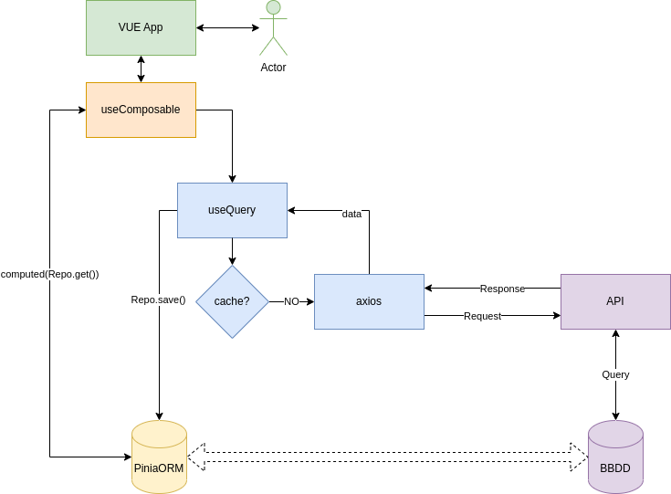

# Exemple pràctic: Composable + Pinia ORM + TanStack

En aquest apartat veurem un exemple pràctic de la integració del que hem vist en el curs en una solució que pot servir en la gran majoria de casos.

La idea general es obtenir un sistema reutilitzable (Composable) que ens gestioni les dades (Pinia ORM) que venen del backend i ens eviti realitzar més peticions de les necessaries (TanStack).

 ## Esquema del funcionament



Com es pot veure a l'esquema, l'usuari al interactuar amb l'aplicació instanciarà un composable. Aquest, en funció de la informació d'entrada (un ID, un filtre...) realitzarà dues accions de forma paralela:

 1. Retornarà les dades locals guardades a Pinia ORM
 1. Realitzarà les peticions a back necessaries.

 En cas de realitzar peticions al backend, una vegada completades, ens actualitzarà les dades exposabdes.

 ## Exemples pràctics

Una serie d'exemples explicats per a realitzar les peticions a l'API d'unc CRUD:
- Un element per id
- Llistat d'elements
- Creació d'un element
- Modificació d'un element
- Eliminació d'un element

### Element per ID

El primer cas es obtenir un element a partir del seu id

```typescript
// Tenim un paràmetre d'entrada que es un id.
export const useExpedient = (expedient_id: number) => {

  // Obtenim l'element de Pinia ORM (podria no existir en un inici)
  const expedient = computed(() =>
    ExpedientRepo.find(idExpedient)
  )

  // Petició amb useQuery, únicament s'executa si no esta en cache
  const { isFetching } = useQuery<Expedient>(
    ['expedient', expedient_id],
    async () => {
      // Petició axios
      const data = await get<Expedient>(
        `/expedient/${expedient_id}`,
        'expedient'
      )
      // Guardam el resultat al piniaORM. Això actualitzarà la variable exposada 
      ExpedientRepo.save(data)
      return data
    }
  )

  // exposam l'entitat i el fetching
  return {
    expedient,

    isFetching,
  }
}
```

El funcionament al instanciar el composable seria el següent:
1. S'executaria el computed de l'entitat i si ja tenim el valor a l'store el retornaria inmediatament
1. S'executaria el use query amb distintes possibilitats:
   * Tenim la cache de l'element activa -> No faria cap petició a l'api.
   * La cache ha caducat o es inexistent -> Realitzaria la petició a l'api
     1. Al guardar el resultat a Pinia ORM s'actualitzaria automàticament el computed de l'entitat.

Es podria donar el cas que a l'hora d'inicialitzar el composable no temin l'id. Una solució podria ser:
- Posar el paràmetre de l'`id` opcional
- Crear una variable reactiva `id` amb el valor que arribi per paràmetre
- Crear un composable `enabled` únicament si l'`id` te valor.
- Passar el reactiu `enabled` a useQuery per a que únicament s'executi si esta actiu.
- Crear un mètode `setId` per posar valor a l'`id`

La forma d'us es tant senzill com inicialitzar el composable
```typescript
const {expedient, isFetching} = useExpedient(props.expedient_id)
```

### Llistat l'elements

El llistat d'expedients es basa en el mateix principi que l'anterior. La dificultat pot residir en haver de filtrar els resultats.

En aquest exemple es mostrarà un cas complex, en la pràctica s'hauràn d'obviar la part que no sigui necessaria en la vostra casuïstica

```typescript
// Definim el filtre necessari
export interface ExpedientFiltre {
  estat_id?: number // Estat de l'expedient
  usuari_id?: number // Usuari que te assignat l'expedient
  onlyActiu: boolean // Únicament actius o tots
  text?: string // Cerca per text (suposam cas complicat que filtre el back)
}

// Obtenim un filtre
export const useExpedients = (_filtre: ExpedientFiltre = {onlyActiu: true}) => {
  // Inicialitzam el filtre amb el paràmetre d'entrada
  const filtre = ref<ExpedientFiltre>(_filtre)

  // Filtre que enviarem al back. Suposem que el filtre per estat es realitzarà sempre al front. Si usam l'altre filtre, cada vegada que filtrem per estat ens realitzarà una petició.
  const filtreBack = computed<ExpedientFiltre>(() => {
    return {
      usuari_id: filtre.value.usuari_id
      onlyActiu: filtre.value.onlyActiu
      text: filtre.value.text
    }
  })

  // Opcional: podem desactivar l'execució automàtica si el filtre es incomplet
  const enabled = computed(
    () => !!filtre.value.estat_id || !!filtre.value.usuari_id
  ) // Exemple: únicament realitzarem petició al back si es filtre per estat o usuari

  // Computed amb el llistat d'expedients, si ja tenim valors a pinia ORM els retornarà encara que no s'hagui completat la petició al back
  const rows = computed(() => {
    const query = ExpedientRepo.query()

    // Aquí s'ha d'aplicar el filtre per a retornar els valos correctes
    if (filtre.value.usuari_id) {
      // Usuari
      query.where('usuari_id', filtre.value.usuari_id)
    }

    if (filtre.value.estat_id) {
      // Estat
      query.where('estat_id', filtre.value.estat_id)
    }

    if (filtre.value.onlyActiu) {
      // Actius, únicament s'aplica si es true
      query.where('actiu', true)
    }

    if (filtre.value.text && data.value) {
      // Quant realitzam filtres al back hem d'usar la variable data que es el que ens retorna tanStack (ja sigui de cache o de la petició).
      const idsBack = data.value.map(e => e.id)
      return query.find(idsBack)
    } else {
      return query.get()
    }
  })

  // UseQuery amb la petició ajax
  const { data, isFetching } = useQuery<Expedient[]>(
    ['expedients', filtreBack],
    // Usam el filtreback de key per evitar peticions quant canvien filtres que no enviam al back.
    async () => {
      // Realitzam petició al back
      const data = await get<Expedient[]>(
        `/expedients`,
        'expedients',
        filtreBack.value
      )
      ExpedientRepo.save(data)
      return data
    },
    {
      enabled: enabled, // opcional, si volem desactivar la petició en certes situacions
    }
  )

  return {
    expedients: rows,
    filtre: filtreExpedient,

    isFetching,
  }
}
```
El funcionament és igual que en el cas anterior:
1. S'executaria el computed del llistat i retornarà els valos que compleixin el filtre i es trobin a Pinia ORM.
1. S'executaria el use query amb distintes possibilitats:
   * Tenim la cache la petició amb el filtre -> No faria cap petició a l'api.
   * La cache ha caducat o es inexistent -> Realitzaria la petició a l'api
     1. Es guardaran els registres a Pinia ORM el que provocarà l'actualització automàticament el computed del llistat.
1. Al exposar el filtre, si el modificam tornarà a inicial els punts anteriors.

En aquest cas hi ha la possibilitat de tenir una part dels elements en memoria local, per tant l'usuari veurà intantaniament uns elements, però al completar-se l'execució de l'api acabaran d'apareixer els que falten.

En relació al filtre hi ha diverses aproximacions que son situacionals. En certs casos el back ja realitzarà un filtratge i tenim l'opció d'aprofitar aquest filtre amb la variable data o de replicar el mateix filtre al front. Per exemple, si tenim un filtre d'elemens actius o no actius segurament es més senzill replicar aquest where al front. Per contra, si es realitza un mega filtre al back podem aprofitar-ho amb l'us de la variable data com hem vist.

```typescript
if (filtre.value.text && data.value) {
  const idsBack = data.value.map(e => e.id)
  return query.find(idsBack)
} else {
  return query.get()
}
```

Un altre punt important es el filtre. UseQuery llanzarà una nova petició cada vegada que el filtre canvia, per això es important que el filtres que s'usa al key de useQuery contengui únicament els elements que el back filtrarà. Si el nostre filtre conté més elements (per que realitzam un filtratge el front) hem d'usar el filtre back.

```typescript
const filtreBack = computed<ExpedientFiltre>(() => {
  return {
    usuari_id: filtre.value.usuari_id
    onlyActiu: filtre.value.onlyActiu
    text: filtre.value.text
  }
})
```
El filtreBack seria el que usariem en el key de useQuery.

Una altre problemàtica que podem tenir amb el filtre, si l'usam directament a un formulari, és que cada vegada que l'usuari el modifica (escriu una lletra, selecciona un valor...) es llanci una petició a l'api. Per això hem de clonar el filtre i en pitjar el botó de cerca tornar a clonar el resultat. Hem d'evitar que s'usi la mateixa referencia.

```typescript
const { filtre } = useExpedients()
const filtreForm = ref({...filtre.value})

const filtrar = () => {
  filtre.value = {...filtreForm.value}
}
```

Aquest cas el veurem amb més detall al següent tema.

Una darrera situació típica que ens pot complicar es quant tenim petición on la url te variables. Per exemple: `/expedients/{expedient_id}/processos`.

La solució passaria per definir aquest `expedient_id` com un paràmetre (al igual que el primer cas d'un expedient per id). Normalment, quant hi ha aquest tipus de peticions la solució es més semblant al cas per id ja que no solem tenir filtre.

### Create, update i delete element

La resta de peticions del crud, que no son GET, es poden concentrar en un composable.

```typescript
// Opcions per executar una acció desde forma al completar una actualització
interface Options {
  onSuccess?
  onError?
  onDelete?
}

export const useExpedientUpdate = (options?: Options) => {
  const toast = useToast()
  const { t } = useI18n()

  // Creació i modificació
  const { mutate, isLoading, isSuccess, isError } = useMutation<
    Expedient,
    unknown,
    Expedient
  >(
    async (expedient) => {
      // Calculam url i metode en funció de si es creació o modificació (si te o no id)
      const url = expedient.id ? `/expedient/${expedient.id}` : '/expedient'
      const method = expedient.id ? Method.PUT : Method.POST

      // Realitzam la petició
      const data = await save<Expedient>(
        url,
        'expedient',
        Expedient.from(expedient),
        method
      )

      // Si es ok guardam el valor a piniaORM
      ExpedientRepo.save(data)
      return data
    },
    {
      onSuccess: (data, variables) => {
        // Missatge de succes
        if (!variables.id) { // Recordar que variables es el valor inicial
          toast.success(
            t('ui.msg.createSuccess', { el: t('exp.lexpedient') })
          )
        } else {
          toast.success(
            t('ui.msg.updateSuccess', { el: t('exp.lexpedient') })
          )
        }

        // Si hem definit acció succes l'executam
        options?.onSuccess?.(data, variables)
      },
      onError: (data, variables) => {
        // Enc as d'error
        options?.onError?.(data, variables)
      },
    }
  )

  // Per a l'eliminació. Canviam el nom de les variables exposades per que es dupliquen amb les anteriors.
  const { mutate: esborra, isLoading: isDeleting } = useMutation<
    void,
    undefined,
    number
  >(
    async (expedient_id) => {
      // petició axios.
      await del(`/expedient/${expedient_id}`)

      // Si es ok borram l'element de piniaORM
      ExpedientRepo.destroy(expedient_id)
    },
    {
      // Missatge de borrat correcte
      onSuccess: (data, variables) => {
        toast.success(t('ui.msg.deleteSuccess', { el: t('exp.lexpedient') }))

        options?.onDelete(data, variables)
      },
    }
  )

  // Exposam les variables
  return {
    update: mutate,
    isUpdating: isLoading,
    isUpdatingSuccess: isSuccess,
    isUpdatingError: isError,

    esborra,
    isDeleting,
  }
}
```

La forma d'usar això es molt senzilla:
```typescript
const {update, esborra} = useExpedientUpdate({
  onSuccess: () => { 
    //coses 
  },
  onDelete: () => { 
    //coses 
  }
})

const crear = (expedient: Expedient) {
  update(expedient)
}

const actualitzar = (expedient: Expedient) {
  update(expedient)
}

const eliminar = (expedient: Expedient) {
  esborra(expedient.id)
}
```