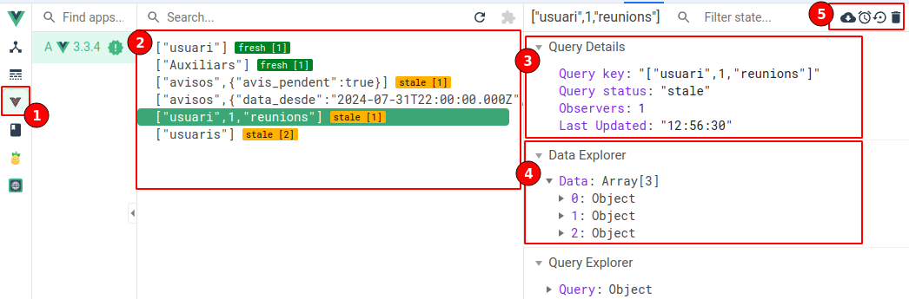

# TanStack

TanStack useQuery és una llibreria que gestiona una cache per facilitar i optimitzar les peticions a la api. Aquesta llibreria es basa en el principi dels composables.

De forma general, evita que una petició es torni a realitzar mentre la cache no hagi caducat (per exemple, 5 min). És a dir, encara que l'usuari entri a la mateixa pantalla (o una pàgina diferent on s'usi la mateixa petició) la petició a base de dades no es tornarà a realitzar si no ha caducat.

## useQuery

Composable per a realitzar peticions de consulta de dades. Manté una cache i evita duplicar peticions.

```typescript
const { parametres_exposats } = useQuery<Entitat_retorn>(
  [key],
  funcio_axios,
  params?);
```

Tenim una key que definirà quan una petició és duplicada o no, una funció que realitzarà la crida a la API i uns paràmetres opcionals.

És important destacar que la `funcio_axios` únicament s'executarà quant la cache amb la `key` no existeixi, o estigui caducada.

Entre els paràmetres exposats els més interessant són:

- **isFetching**: una variable reactiva que ens indica si s'està llançant la petició a l'API. A diferència de isLoading que s'activa sempre, encara que estigui en cache.
- **data**: Es correspon al return de `funcio_axios`, és una variable reactiva que va canviant en funció del `key` una vegada acaba la peticio a l'API o des de cache. És útil en certs casos.
- **refetch**: És un mètode que ens permet forçar l'execució de la petició a l'API indistintament de l'estat de la cache.

### Exemple get un registre

```typescript
const { isFetching } = useQuery<Expedient>(
  ["expedient", idExpedient],
  async () => {
    // petició axios
    const data = await get<Expedient>(
      `/expedient/${idExpedient}/procediments`,
      "expedient"
    );
    // guardam dades al piniaORM
    ExpedientRepo.save(data);
    return data;
  }
);
```

### Exemple llistat amb filtre

Notar que al key es passa un objecte filtre, això provoca que, si els valors del filtre canvien, la key canviarà i es realitzarà una nova petició de forma automàtica. S'ha d'anar alerta amb filtres de text, ja que a l'escriure una lletra podria realitzar una petició nova, per evitar-ho, el millor és clonar l'objecte filtre, com veurem més endavant.

```typescript
const { isFetching } = useQuery<Expedient[]>(
  ["expedients", filtre],
  async () => {
    // petició axios
    const data = await get<Expedient[]>(
      `/expedients`,
      "expedients",
      filtre.value
    );
    // guardam dades a piniaORM
    ExpedientRepo.save(data);
    return data;
  }
);
```

### Enabled

Un dels paràmetres més interessant és el `enabled`, que ens permet activar o desactivar la realització de la petició a l'API.

Un exemple pràctic pot ser quant per reactivitat un valor pot no estar carregat des de l'inici. Anam a suposar una petició que retorna els expedients d'una persona, però l'id d'aquesta pot no estar carregat des de l'inici.

```typescript
// Calculam amb un computed quant la petició ha d'estar activada
const enabled = computed(() => !!persona_id.value);

const { isFetching, isError, refetch } = useQuery<Expedient[]>(
  ["persona", { persona_id }, "expedients"],
  async () => {
    // Petició axios a API
  },
  {
    enabled: enabled,
  }
);
```

Encara que no és necessari usar un computed en un cas tan senzill, és més clar, i alguns casos més complexos, sol ser recomanable.

## useMutation

El composable mutation ens facilita les peticions de creació, actualització i eliminació de registres. No manté cache i s'executen sempre.

```typescript
const { parametres_exposades} = useMutation<Entitat_retorn,unknown,Entitat_entrada>(
  funcio_axios,
  params?)
```

Com podem veure, també tenim una funció a executar i uns paràmetres.

Dels paràmetres destacarem `onSuccess` que s'executa una vegada ha finalitzat la petició a l'API de forma correcta. No tenim en compte `onError` ja que ja hem configurat axios per a que mostri un missatge, però en el seu cas es podria usar.

### Exemple Creació i modificació

Encara que es podria separar, degut a la similitud, la petició de creació i modificació la realitzam amb el mateix mutation.

```typescript
const { mutate, isLoading } = useMutation<Expedient, unknown, Expedient>(
  async (expedient) => {
    // Calculam mètode i ruta en funció de si es creació o modificació
    const url = expedient.id ? `/expedient/${expedient.id}` : "/expedient";
    const method = expedient.id ? Method.PUT : Method.POST;
    // petició axios
    const data = await save<Expedient>(
      url,
      "expedient",
      Expedient.from(expedient),
      method
    );
    // s'ha guardat bé i guardam dades a piniaORM
    ExpedientRepo.save(data);
    return data;
  },
  {
    onSuccess: (data, variables) => {
      // Si es ok missatge success
      if (!variables.id) {
        toast.success(t("ui.msg.createSuccess", { el: data.numero_expedient }));
      } else {
        toast.success(t("ui.msg.updateSuccess", { el: data.numero_expedient }));
      }
    },
  }
);
```

### Exemple Eliminació

El cas de l'eliminació és semblant

```typescript
const { mutate, isLoading } = useMutation<void, undefined, number>(
  async (expedientId) => {
    await del(`/expedient/${expedientId}`);
    ExpedientRepo.destroy(expedientId);
  },
  {
    onSuccess: (data, variables) => {
      toast.success(t("ui.msg.deleteSuccess", { el: t("exp.lexpedient") }));
      options?.onDelete(data);
    },
  }
);
```

Tant en un cas, com en l'altre, notar que onSuccess exposa un `data` i un `variables`. `data` és el valor retornat per la `funcio_axios`, és a dir, per l'API i `variables` és el valor d'entrada, és a dir, el valor que hem enviat a l'API.

## DevTools: Cache useQuery

L'extensió DevTools també te un apartat per a la cache de useQuery (peticions GET) on ens indica la key, l'estat, la data d'actualització, els valors en cache...



1. Pipella de l'opció de cache useQUery
2. Llistat d'elements a la cache per key i amb l'estat actual.
3. Detalls de la cache.
4. Dades de la cache (es correspon a la propietat data de useQuery)
5. Accións per a interactuar amb la cache.
