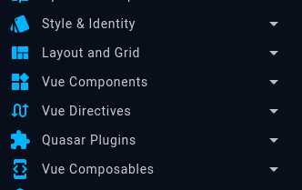
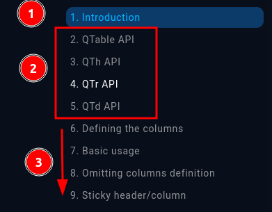
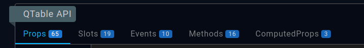

# Quasar

Quasar és un framework de Vue. A més de facilitar la configuració de projectes amb Vue (a l'esquelet ja ve tot configurat) ens aporta tota una col·lecció de components, classes CSS i composables per a facilitar la creació de les nostres pàgines.

A aquest tema no entrarem en detall de tot el contingut de quasar, ja que no acabaríem mai, serà una tasca que haureu d'anar investigant poc a poc. El que sí que farem és estudiar les pantalles més típiques que us podreu trobar usant els components de Quasar.

## Primeres passes

Abans d'entrar en els exemples farem un petit recorregut de com navegar per la documentació de quasar.

La primera passa serà accedir a la documentació: https://quasar.dev/components

Els elements del menú que més atenció prestarem són:



1. **Style & Identity**: Aquí trobarem el conjunt de classes css per donar format. Seria dessitjable usar aquestes classes abans que crear les nostres pròpies.
1. **Layout and grid**: Classes css per organitzar les pàgines amb el típic patró de 12 columnes. Si teniu dubtes sobre el funcionament de flex, és de lectura obligatòria [A Complete Guide to Flexbox](https://css-tricks.com/snippets/css/a-guide-to-flexbox/)
1. **Vue Components**: Entram a la part central de Quasar amb tota la colecció de components que tenim disponibles. Seria recomanable pegar una ullada a tot allò que hi ha disponible.

La resta d'apartats com les Directives i els Composables, encara que són útils i estaria bé conèixer-ho, quedarien com un contingut més avançat.

### Components

Entrant en el detall dels components podrem observar que podem separar el contingut en tres blocs.



1. **Introducció**: La introducció ens descriu què fa el component
2. **API**: Aquest apartat ens resumeix totes les opcions que té disponibles el component.
3. **Exemples**: Exemples de casos d'ús.

Encara que els exemples ens poden clarificar el funcionament, l'apartat d'API és el que ens dona més informació



Dependrà del component, però poden tenir divesos apartats. Com podeu observar es corresponen a les formes de Vue d'interactuar entre components (props, emits, slots...)

- **Props**: Les propietats són els paràmetres amb els que podem configurar el component
- **Slots**: La forma de personalitzar parts del codi
- **Events**: Els events són els emits que té el component
- **Methods**: Es correspondria als exposes del components, s'ha d'accedir a través de la referència del component.
- **ComputedProps**: Són unes propietats a les quals s'accedeix a través de la referència del component. No hi ha massa components que ho tenguin.

## Exemples pràctics

### Llistat

Els llistats són la forma més típica de mostrar un gran conjunt de dades. Així i tot, no hem de caure en la idea de que sempre que tenim un llistat s'ha de mostrar en format llista, quan es tracta de llistes de pocs elements, pot ser més recomanable usar una altra representació.

Normalment els llistat aniran associats a una vista, ja que es sol accedir directament a través d'una ruta. Així i tot, no hi hauria problema en adaptar l'exemple a un component, en el seu cas.

```html
<template>
  <div class="row">
    <div class="col-12">
      <!-- Capçalera amb ti titol de la vista -->
      <h1>{{ t('exp.expedient', 2) }}</h1>
    </div>

    <div class="col-12">
      <!-- Inici de la taula -->
      <q-table
        :rows="expedients" 
        :columns="columns()"
        row-key="id"
        :loading="isFetching"
      >
        <template #top>
          <!-- Definim la capçalera mitjançant un slot. 
          Aquesta contindrà un filtre i un botó per a crear -->
          <FiltreExpedient v-model="filtreExpedient" class="col-grow" />

          <q-btn
            round
            color="positive"
            icon="fa-solid fa-plus"
            @click="nouExpedient"
          />
        </template>

        <template #body-cell-estat="props">
          <!-- Slot personalitzat per l'estat, 
          aquest es mostrarà en chips de colors -->
          <q-td :props="props">
            <q-chip
              :color="Estat.color(props.value)"
              text-color="white"
              :label="props.value?.nom"
            />
          </q-td>
        </template>

        <template #body-cell-accions="props">
          <!-- Un darrer slot per les accions, en aquest cas per accedir a la vista de l'expedient. -->
          <q-td :props="props">
            <q-btn
              flat
              dense
              color="primary"
              icon="fa-solid fa-eye"
              :to="{ name: 'ExpedientView', params: { id: props.value } }"
            />
          </q-td>
        </template>
      </q-table>
    </div>
  </div>

  <!-- Instanciam el dialog d'edició d'expedients  -->
  <ExpedientFormDialog ref="expedientFormDialog" />
</template>
```

```typescript
  import useBreadcrumbs from '@/core/composables/useBreadcrumbs'
  import { Estat } from '@/models/Estat'
  import { Persona } from '@/models/Persona'
  import dayjs from 'dayjs'
  import { QTableColumn } from 'quasar'
  import { onMounted, ref } from 'vue'
  import { useI18n } from 'vue-i18n'
  import ExpedientFormDialog from '../components/ExpedientFormDialog.vue'
  import FiltreExpedient from '../components/FiltreExpedient.vue'
  import { useExpedients } from '../composables/useExpedients'

  const { t } = useI18n()
  // Definim la referència al component d'edició de l'expedient
  const expedientFormDialog = ref()
  // Usant el composable obtenim les dades necessèries per mostrar a la vista.
  const { expedients, filtreExpedient, isFetching } = useExpedients()
  // Un mètode per a la creació d'expedients
  const nouExpedient = () => {
    const _expedient = Expedient.from()
    // És el lloc ideal per inicialitzar les dades de l'expedient
    _expedient.data = new Date()
    // Finalment, obrim el dialog
    expedientFormDialog.value.open(_expedient)
  }

  // Inicialitzam les "migas de pan", s'ha de fer dins l'onmounted ja que sinó 't' no està inicialitzat.
  onMounted(() => {
    useBreadcrumbs([
      {
        label: t('pro.programa', 2),
      },
      {
        label: t('exp.expedient', 2),
      },
    ])
  })

  // La part important del llistat, definir les columnes. Notem que és un mètode degut a que 't' no està inicialitzat a l'inici. També es podria fer amb un computed o un ref i onMounted.
  const columns = (): QTableColumn[] => [
    {
      name: 'id', // nom intern de la columna, un dels usos és definir l'slot
      label: t('exp.id'), // Capçalera, idealment ha de venir de tradiccions
      field: 'id', // Camp de l'objecte que es mostrarà
      sortable: true,
    },
    {
      name: 'data_registre',
      label: t('exp.data_registre'),
      field: 'data_registre',
      // Es pot definir un format en el cas que no volguem el valor per defecte
      format: (val) => dayjs(val).format('DD/MM/YYYY HH:mm'),
      sortable: true,
    },
    {
      name: 'titular',
      label: t('exp.titular'),
      field: 'titular',
      format: val => Persona.nomComplet(val)
      // Es pot canviar l'aliniació del text dins la columna
      align: 'left',
    },
    {
      name: 'estat',
      label: t('exp.estat'),
      // Es els casos on volguem accedir a objectes interns ho podem fer usant un mètode per definir el camp
      field: (row) => row.estat?.estat,
      align: 'left',
    },
    {
      // Les accions les definim, però es personalitzen amb un slot
      name: 'accions',
      label: '',
      field: 'id',
    },
  ]
```

Aquest és un exemple bàsic on s'han vist les casuístiques més habituals, però les taules tenen multitut d'opcions que podeu investigar a la documentació oficial.

### Form Dialog

L'edició de les dades és un dels altres pilars de les aplicacions. En aquest cas, usarem un dialog en lloc d'una vista, ja que són més versàtils. En qualsevol cas, l'ideal seria reutilitzar el mateix formulari per a la creació i modificació (sempre que no hi hagi grans diferències)

A fi de que el codi sigui més fàcil de mantenir hauríem d'intentar evitar mega-formularis i, en el seu lloc, usar petits formularis que modifiquin coses concretes. En aquest exemple, el formulari editarà les propietats de l'expedient i l'edició, per exemple, del titular anirà en un altre.

```html
<template>
  <!-- Definim el dialog, al ser un cas especial no fa falta deixar un div que englobi tot -->
  <!-- Per evitar problemes de typescrip veim que únicament sigui visible si té expedient -->
  <q-dialog v-if="expedient" v-model="dialog" persistent>
    <q-card style="width: 1280px; max-width: 90vw">
    
      <q-toolbar class="bg-primary text-white">
        <!-- Capçalera de la card dinàmica, en funció de si és edició o creació -->
        <q-toolbar-title>
          {{ expedient.id ? t('ui.update') : t('ui.create') }}
          {{ t('exp.expedient').toLowerCase() }}
        </q-toolbar-title>

        <q-btn v-close-popup dense flat icon="fa-solid fa-xmark" />
      </q-toolbar>

      <q-card-section>
        <!-- Iniciam el formulari, important definir el mètode submit. 
        Greedy fa que al pitjar submit validi tots els camps en lloc del primer amb error -->
        <q-form
          class="row q-col-gutter-md"
          greedy
          @submit="() => update(expedient!)"
        >
          <!-- Aquí ja podem començar a definir els camps -->
          <q-input
            v-model="expedient.num_registre"
            class="col-12 col-sm-6 col-md-4 col-lg-3"
            filled
            :label="t('exp.num_registre')"
            :rules="[obligatori]"
          />

          <!-- El ImputDate és un component personalitzat, imita l'estil de quasar. El motiu d'usar un component personalitzat és que quasar maneja les dates en format text i no Date -->
          <InputDate
            v-model="expedient.data_registre"
            class="col-12 col-sm-6 col-md-4 col-lg-3"
            filled
            :label="t('exp.data_registre')"
            :rules="[obligatori]"
            clearable
          />

          <!-- Un altre component personalitzat per mostrar un botó, per defecte, amb true/false, es pot personalitzar amb la propietat opcions -->
          <InputButton
            class="col-12 col-sm-6 col-md-4 col-lg-3"
            v-model="expedient.urgencia"
            :title="t('sol.urgencia')"
            :color="expedient.urgencia ? 'negative' : 'positive'"
          />

          <!-- Select simple, és important no deixar-se les propietats emit-value i map-opcions, en cas contrari, ens emplenarà el valor com a objecte -->
          <q-select
            v-model="expedient.motiu_derivacio_id"
            emit-value
            map-options
            class="col-12 col-sm-6 col-md-4 col-lg-3"
            filled
            use-input
            :options="motiusDerivacio"
            :label="t('exp.motiu_derivacio')"
            option-label="nom"
            option-value="id"
            clearable
          />

          <!-- Selector simple amb filtre, és útil en el cas de tenir moltes opcions. És important tenir marcada l'opció use-input, ja que sinó no es podrà escriure -->
          <q-select
            v-model="expedient.treballador_social_id"
            emit-value
            map-options
            class="col-12 col-md-8 col-lg-6"
            filled
            use-input
            :options="treballadorsSocials"
            :label="t('exp.treballador_social')"
            @filter="filterTreballadorsSocials"
            clearable
          />

          <!-- Un darrer exemple de selector múltiple. És imprescindible marcar l'opció multiple. També destacar la propietat use-chips per a que es vegi millor.  -->
          <q-select
            v-model="proces.motius_consulta_id"
            emit-value
            map-options
            class="col-12 col-sm-8"
            filled
            multiple
            use-input
            :options="motiusConsulta"
            option-label="nom"
            option-value="id"
            clearable
            use-chips
            :label="t('exp.motius_consulta')"
            :rules="[obligatori]"
          />

          <!-- Un darrer exemple d'un textarea. Si anam justos d'espai tenim la propietat autogrou que anirà fent gran el text area a mesura que escriguin -->
          <q-input
            v-model="expedient.observacions"
            type="textarea"
            class="col-12"
            filled
            :label="t('exp.observacions')"
          />

          <!-- Finalment, tenim els botos en un component extern per reutilitzar codi. En grans línies és un button type submit per guardar un button normal per eliminar -->
          <FormButtons
            class="col-12"
            :is-update="!!expedient.id"
            :show-delete="!!expedient.id"
            :nom-entitat="t('exp.lexpedient').toLowerCase()"
            @delete="esborra(expedient.id)"
            :is-deleting="isDeleting"
            :is-updating="isUpdating"
          />
        </q-form>
      </q-card-section>
    </q-card>
  </q-dialog>
</template>
```

Els subcomponents usats els podreu trobar dins el projecte

```typescript
  import useSelectFilter from '@/core/composables/useSelectFilter'
  import { obligatori } from '@/core/utils/validacionsQuasar'
  import {
    DiagnosticSocialRepo,
    MotiuDerivacioRepo,
    TipusUnitatRepo,
  } from '@/models'
  import { DiagnosticSocial } from '@/models/DiagnosticSocial'
  import { Expedient } from '@/models/Expedient'
  import { TreballadorSocial } from '@/models/TreballadorSocial'
  import FormButtons from '@/modules/shared/components/FormButtons.vue'
  import InputDate from '@/modules/shared/components/InputDate.vue'
  import { computed, ref } from 'vue'
  import { useI18n } from 'vue-i18n'
  import { useRouter } from 'vue-router'
  import { useTreballadorsSocials } from '../../contactes/composables/useTreballadorsSocials'
  import { useExpedientUpdate } from '../composables/useExpedientUpdate'

  const { t } = useI18n()
  const router = useRouter()
  // Declaram l'objecte que editarem
  const expedient = ref<Expedient>()
  // També hem de definir una deferencia al dialog
  const dialog = ref<boolean>(false)

  // Definim l'expose que obrirà el dialog i, a més, inicialitzarà l'objecte a editar
  const open = (_expedient?: Expedient) => {
    // És important realitzar una còpia i no editar directament la referència, és el què fa el mètode from. També ens mapeja les relacions NM
    expedient.value = Expedient.from(_expedient)

    dialog.value = true
  }

  defineExpose({ open })

  // Instanciam el composable d'edició
  const { update, isUpdating, esborra, isDeleting } = useExpedientUpdate({
    onSuccess: (data, variables) => {
      // En aquest cas, si és una creació cambiam de vista i una modificació tancam el dialog
      if (variables.id) {
        dialog.value = false
      } else {
        router.push({ name: 'ExpedientView', params: { id: data.id } })
      }
    },
    onDelete: () => {
      dialog.value = false
    },
  })

  // Instanciam els llistats dels selects
  const motiusDerivacio = computed(() => MotiuDerivacioRepo.all())

  // En el cas del treballador social, que tenia un filtre, tenim un composable que ens fa el filtre a partir del llistat d'objectes
  const { treballadorsSocials: _trebalaldorsSocials } = useTreballadorsSocials()

  const { data: treballadorsSocials, filter: filterTreballadorsSocials } =
    useSelectFilter<TreballadorSocial>({
      repo: _trebalaldorsSocials,
      field: (ts) => TreballadorSocial.nomComplet(ts, true),
    })
```

#### Rules

Les rules són les que ens permet validar el formulari de forma dinàmica. El seu funcionament és senzill encara que pot no ser trivial de comprendre.

La propietat rules accepta un array de funcions, una per cada validació. Aquestes funcions han de retornar o `true` o un string amb el missatge d'error.

```typescript
const obligatori = (val) => {
  if(!!val){
    return true
  } else {
    return t('ui.validacio.obligatori') //El valor es obligatori
  }
}
```
Si es així, per què els exemples que ens posa es veuen d'aquesta manera?
```typescript
 val => val.length <= 3 || 'Please use maximum 3 characters'
```

Això es deu a que amb JavaScript la validació OR no retorna un boolea, sinó el primer objecte evaluat com a true. És a dir, si la longitud de val és 2 es complirà la primera avaluació i retornarà `true`, però si la longitud és 4, la primera serà `false`, continuarà l'avaluació i retornarà la cadena de text, encara que aquesta s'hagui avaluat com a `true`


### Filtre

Anam a veure un altre element típic en una aplicació com és el filtre. A l'exemple del llistat hem vist com cridàvem aquest component. La part del template és molt semblant amb formulari vist anteriorment.

```html
<template>
  <div>
    <q-form greedy class="row q-col-gutter-md" @submit="cercar">
      <q-input
        dense
        filled
        v-model="filtre.titular"
        :class="props.inputClass"
        :label="`${t('ui.btn.search')} ${t('exp.membre').toLowerCase()}`"
        :rules="[
          (val) => minLength(val, 3),
          (val) => filtre.onlyActiu || obligatori(val),
        ]"
      />

      <InputButton
        dense
        :title="t('usu.actiu')"
        v-model="filtre.onlyActiu"
        :options="estat"
        :class="inputClass"
      />

      <div>
        <q-btn
          type="submit"
          color="teal"
          icon="fas fa-magnifying-glass"
          :title="t('ui.btn.search')"
        />
      </div>
    </q-form>
  </div>
</template>
```

A la part del codi és on hi ha la part interessant. Per evitar que cada vegada que fan un canvi a un input del filtre es generi una consulta hem de clonar el filtre per a no tenir la mateixa referència.

```typescript
import { minLength, obligatori } from '@/core/utils/validacionsQuasar'
  import InputButton from '@/modules/shared/components/InputButton.vue'
  import { computed, ref } from 'vue'
  import { useI18n } from 'vue-i18n'
  import { ExpedientFiltre } from '../composables/useExpedients'

  const { t } = useI18n()

  // Obtenim el filtre com un v-model
  interface Props {
    modelValue: ExpedientFiltre
    inputClass?: string
  }

  const props = withDefaults(defineProps<Props>(), {
    inputClass: 'col-12 col-sm-6 col-md-2 col-lg-2',
  })

  // En lloc d'usar un computed obtenim el filtre de props i, per no usar la mateixa deferència, feim una còpia del filtre.
  const filtre = ref({ ...props.modelValue })

  interface Emits {
    (e: 'update:modelValue', data: ExpedientFiltre): void
  }

  const emit = defineEmits<Emits>()

  // Al pitjar cercar emetrem el canvi a la propietat, com veim també clonam l'objecte.
  const cercar = () => {
    emit('update:modelValue', { ...filtre.value })
  }

  const estat = computed(() => [
    {
      label: t('usu.filtre.act.true'),
      value: true,
    },
    {
      label: t('usu.filtre.act.false'),
      value: false,
    },
  ])
```