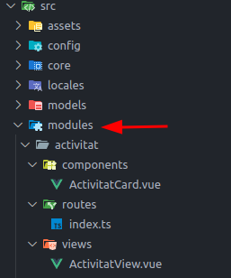

# Passes per inicialitzar un component per fer proves

Una opció per fer proves amb l'esquetet podria ser crear un nou mòdul (una carpeta dins modules) i dins aquesta crear una carpeta components, composables, routes i una views on posar els documents que es van creant. 



Dins aquestes capetes podrieu crear almenys una vista i els components i composables que requeresqui l'activitat.

La vista es pot inicialitzar amb el següent contingut:

```html
<template>
  <div>
  </div>
</template>

<script setup lang="ts">
// Important el setup per usar el composition api
</script>

<style scoped></style>

```

Per a poder accedir a la vista s'ha de crear la ruta, per això, dins la carpeta routes s'ha de crear el fitxer index.ts (igual que com esta a demo). El path ens indica la ruta a la que haurem d'accedir.

```typescript
import { RouteRecordRaw } from 'vue-router'

// Importam com a constant el fitxer
const ActivitatView = () => import('../views/ActivitatView.vue')

export const activitatRoutes: RouteRecordRaw[] = [
  {
    path: 'activitat', // path del navegador http://localhost:8080/vue3-skeleton/activitat
    component: ActivitatView,
    name: 'ActivitatView', // Nom que donam a la vista (pot ser el mateix nom que el fitxer)
  },
]
```

Apart d'això s'ha d'importar aquestes rutes al fitxer general `src/config/routes.ts` que es el que llegeix l'aplicació.

```typescript
import { activitatRoutes } from '@/modules/activitat/routes' // Importació
import { demoRoutes } from '@/modules/demo/routes'
import { RouteRecordRaw } from 'vue-router'

const Home = () => import('@/modules/shared/views/Home.vue')

export const routes: RouteRecordRaw[] = [
  {
    path: '',
    component: Home,
    name: 'Home',
  },
  ...demoRoutes,
  ...activitatRoutes, // adjuntam les rutes del modul al fitxer general"
]
```

A aquest punt podriem arribar a la vista per la ruta de navegador. Si a més es vols crear un item al menú es pot fer afegint un item a `src/config/menu.ts`. La part important es el name que ha de ser igual al definit a la ruta.

```typescript
export const navbarItems: ImasNavbarItemHeader[] = [
  {
    title: () => tc('home'),
    to: { name: 'Home' },
    icon: 'fas fa-home',
  },
  {
    title: 'Activitat',
    icon: 'fas fa-clock',
    to: { name: 'ActivitatView' }, // El nom ha de coincidir amb el name definit anteriorment
  },
  // ... la resta de rutes
]
```

Arribats a aquest punt podem anar creant els fitxers de l'activitat en questió dins la carpeta corresponent del mòdul que hem creat i fent us de la vista per visualitzar el resultat.

Per exemple, si cream un component i el volem instanciar a la vista, aquesta quedaria de la següent manera:
```html
<template>
  <div>
    <ActivitatCard /> <!-- Posició del component dins el template -->
  </div>
</template>

<script setup lang="ts">
  // Importació del component
  import ActivitatCard from '../components/ActivitatCard.vue'
</script>

<style scoped></style>
```

Per a entregar l'activitat es podria comprimir la carpeta del mòdul i entregar al moodle.